# 🧠 NeuroMentor – Tutor Cognitivo com IA

> Projeto final da **Imersão IA 2025** – promovida por **Alura + Google**  
> Desenvolvido por [@vthamada](https://github.com/vthamada)

**NeuroMentor** é um agente educacional inteligente que utiliza IA generativa para criar trilhas de aprendizagem personalizadas com base no estilo cognitivo do estudante. A plataforma adapta conteúdos, quizzes, mapas mentais e até voz sintetizada para ajudar qualquer pessoa a aprender de forma mais eficiente, engajadora e autônoma.

---

## 🚀 Funcionalidades

| Categoria                 | Recursos                                                                 |
|--------------------------|--------------------------------------------------------------------------|
| 🎯 Personalização         | Detecção de estilo cognitivo: visual, auditivo, leitura/escrita ou cinestésico |
| 📚 Plano de Estudo        | Geração de conteúdo adaptado, com resumo, cronograma e sugestões específicas |
| 📝 Quiz Interativo        | Avaliação formativa com explicações, pontuação e gráfico de progresso     |
| 📈 Métricas e Gamificação | XP, badges (iniciante, avançado, mestre), evolução cognitiva             |
| 🗺️ Mapas Mentais          | Gerados automaticamente com fallback textual em caso de erro              |
| 🌐 Recursos Web Reais     | Busca por links relevantes sobre o tema estudado                          |
| 🔈 Leitura em Voz Alta    | Conversão de texto para áudio com reprodução direta na interface          |
| 🃏 Flashcards             | Resumo automático com cartões interativos para fixação                    |
| 🗓️ Revisão Inteligente    | Planejamento com base em Spaced Repetition (dias 1, 3, 7, 14)             |
| 🎯 Desafio Diário         | Reforço diário com questões surpresa e práticas aplicadas                |

---

## 🧪 Tecnologias

- `Python 3.10+`
- `Streamlit` — UI Web moderna e leve
- `Google Generative AI SDK (Gemini 2.0 Flash)`
- `matplotlib` — gráficos interativos
- `streamlit-mermaid` — visualização de mapas mentais
- `gTTS` — texto para voz
- `requests`, `textwrap`, `io`, `datetime`

---

## 📂 Estrutura do Projeto
```
NeuroMentor/
│
├── main.py                      # Interface e fluxo principal
├── agents/                      # Módulos da IA
│   ├── cognitive_style.py
│   ├── plan_generator.py
│   ├── web_search.py
│   ├── time_calculator.py
│   ├── progress_graph.py
│   ├── spaced_review.py
│   ├── daily_challenge.py
│   ├── quiz_generator.py
│   ├── flashcards.py
│   └── mindmap.py
│
├── utils/
│   ├── gemini.py                # Wrapper do Gemini SDK
│   └── tts.py                   # Texto para fala
│
├── requirements.txt
└── README.md

```
---

## ▶️ Como Executar

**1. Clone o repositório**:

```bash
git clone https://github.com/vthamada/NeuroMentor.git
cd NeuroMentor
```

**2. Crie e ative um ambiente virtual** (opcional, mas recomendado):

```bash
python -m venv .venv

# Linux/macOS:
source .venv/bin/activate

# Windows:
.venv\Scripts\activate
```
**3. Instale as dependências:**

```bash
pip install -r requirements.txt
```
**4. Defina sua chave da API Gemini:**

Crie um arquivo `.env` na raiz do projeto com o seguinte conteúdo:

```env
GEMINI_API_KEY="sua-chave-aqui"
```
✅ Esta chave é necessária para autenticar com o modelo Gemini via Google Generative AI SDK.

⚠️ Importante: Não compartilhe esse arquivo publicamente. Certifique-se de que ele está incluído no .gitignore.

**5. Execute o app:**

```bash
streamlit run main.py
```

---

## 📸 Exemplos Visuais

### ✅ Detecção do Estilo Cognitivo  
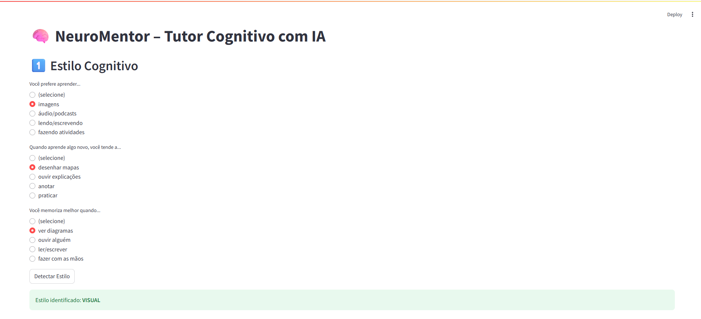

### ✅ Seleção de Tema  
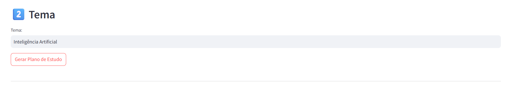

### ✅ Plano de Estudo Personalizado  
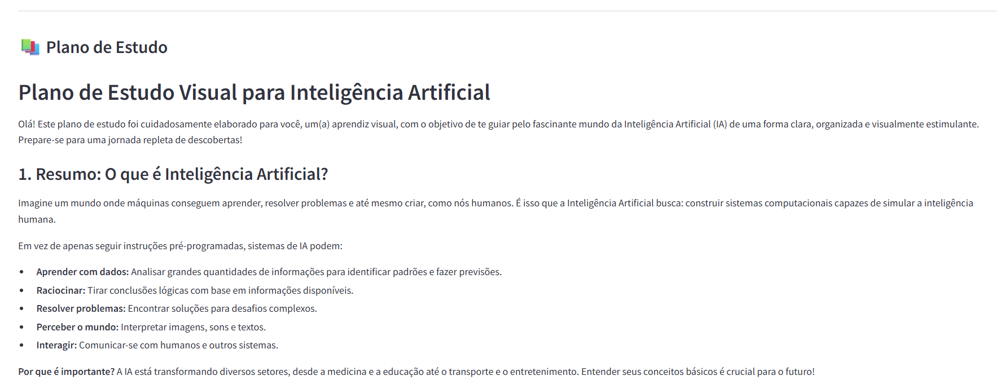

### ✅ Estimativa de Tempo de Estudo  
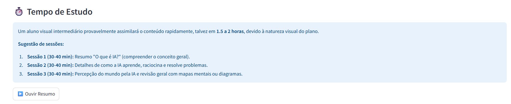

### ✅ Mapa Mental Gerado  
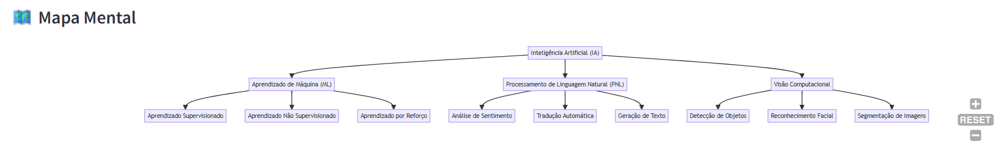

### ✅ Recursos Reais da Web  
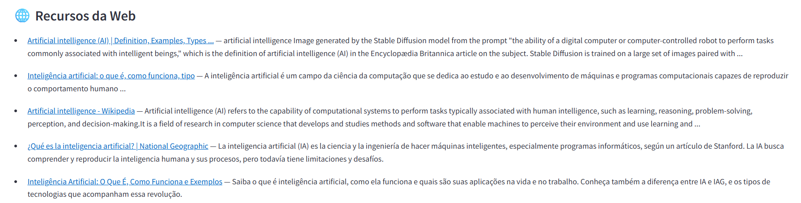

### ✅ Quiz Interativo  
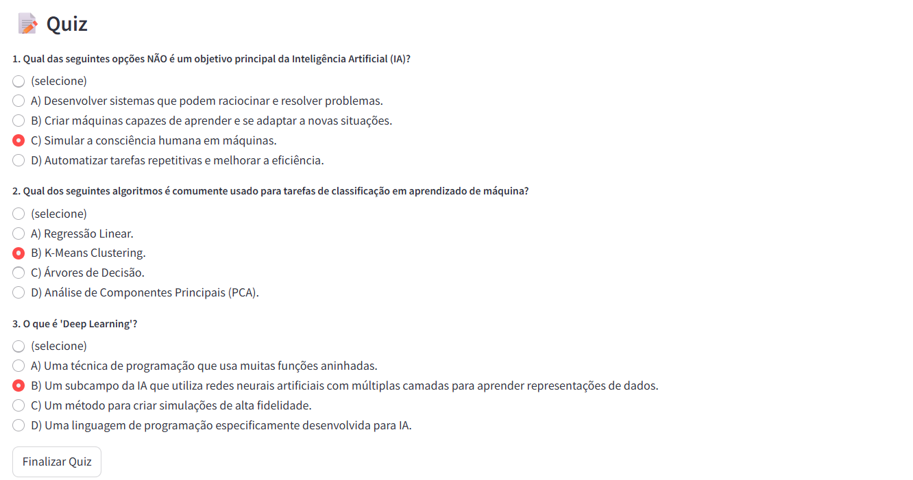

### ✅ Respostas com Feedback  
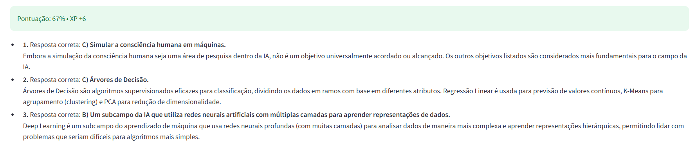

### ✅ Gráfico de Progresso Cognitivo  
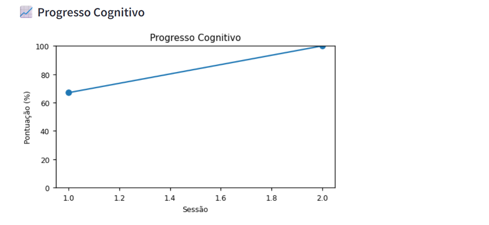

### ✅ Flashcards Automáticos  
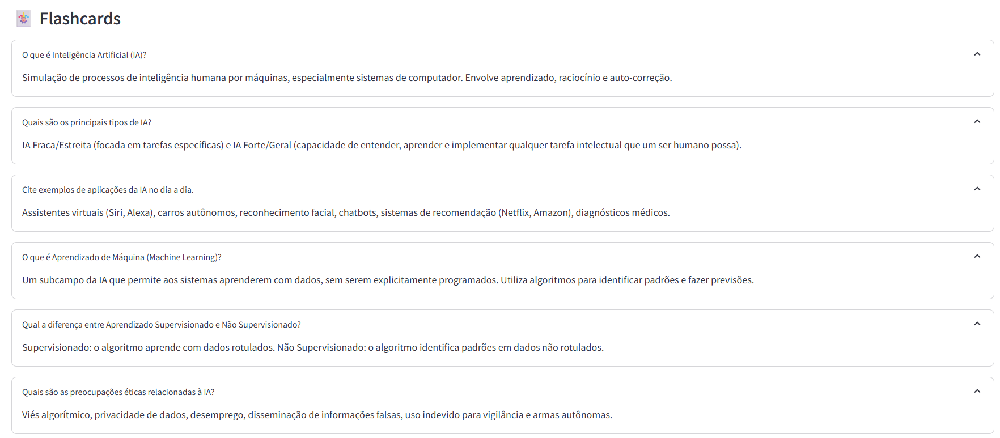

### ✅ Sistema de Badges  
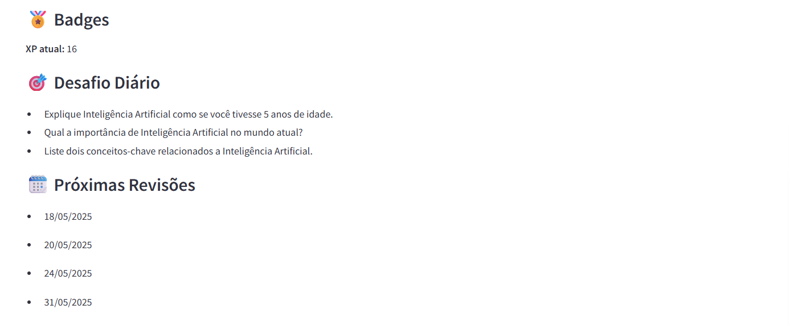


---

## 🧠 Inspiração
Criado como parte do desafio da Imersão IA 2025 – Alura + Google, com o objetivo de transformar a educação personalizada com ferramentas modernas de IA.

---

## 📄 Licença
Este projeto é de uso livre para fins educacionais. Para uso comercial, consulte o autor.

---

## 🙋‍♂️ Autor
Ricardo Hamada

[LinkedIn](linkedin.com/in/ricardohamada) • [GitHub](https://github.com/vthamada)
